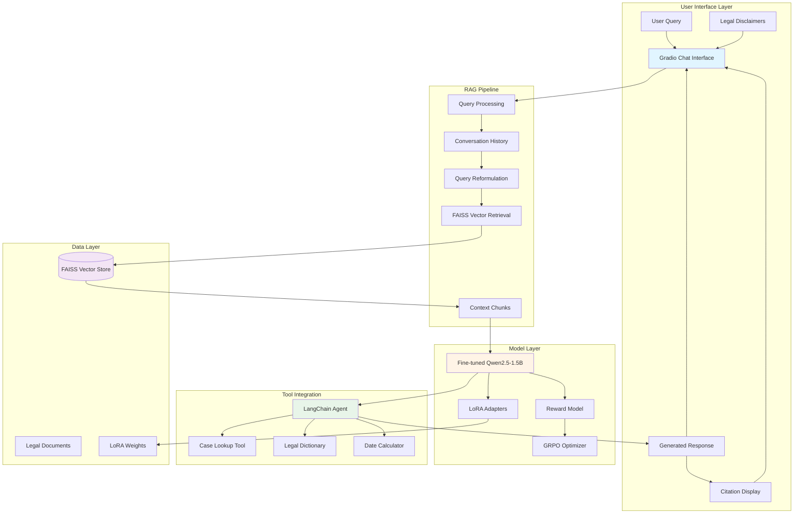
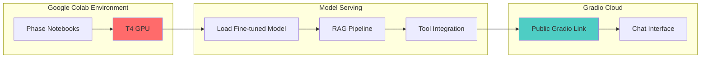

# LawBot Architecture

## System Architecture Diagram

## Data Flow

1. **User Input**: User submits a legal question through Gradio interface
2. **Query Processing**: System captures query and conversation history
3. **Query Reformulation**: Enhance query with context for better retrieval
4. **Vector Retrieval**: Search FAISS index for relevant legal document chunks
5. **Context Assembly**: Combine retrieved chunks into context
6. **Model Inference**: Pass context + query to fine-tuned Qwen2.5-1.5B model
7. **Tool Call Decision**: Agent decides if tool calling is needed
   - Case lookup for specific case details
   - Legal dictionary for term definitions
   - Date calculator for deadlines
8. **Response Generation**: Generate grounded response with citations
9. **RLHF Post-processing**: Apply reward model scoring and GRPO optimization
10. **Output Display**: Show response with citations and tool traces in Gradio UI

## Component Details

### Fine-Tuning Pipeline
- Base Model: Qwen2.5-1.5B-Instruct
- Quantization: 4-bit QLoRA via Unsloth
- Adapters: LoRA (rank=16, alpha=32)
- Training: 3 epochs with gradient accumulation
- Dataset: Indian legal Q&A (IPC, CrPC, Constitution)

### RAG Pipeline
- Embeddings: sentence-transformers/all-MiniLM-L6-v2
- Chunking: 600-1000 tokens with 100-token overlap
- Retrieval: Top-k (k=5) with FAISS similarity search
- Sources: Bare Acts, case summaries, legal documents

### Tool Integration
- LangChain Agent with function calling
- Tools: Case lookup, legal dictionary, date calculator
- Trace visualization for transparency

### RLHF Pipeline
- Reward Model: Trained on 30+ preference pairs
- Criteria: Accuracy, clarity, citations, legal tone
- Optimization: GRPO via Unsloth Trainer

## Deployment Architecture

